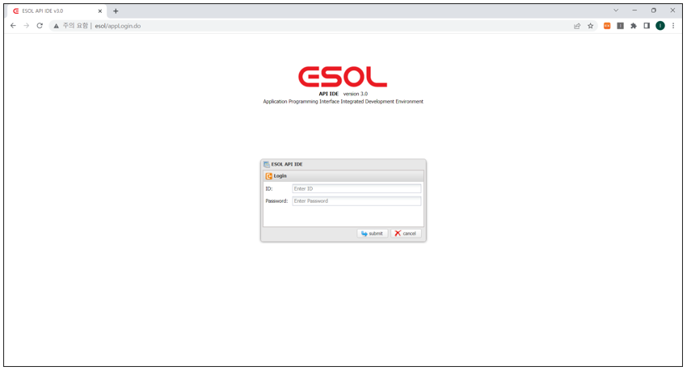
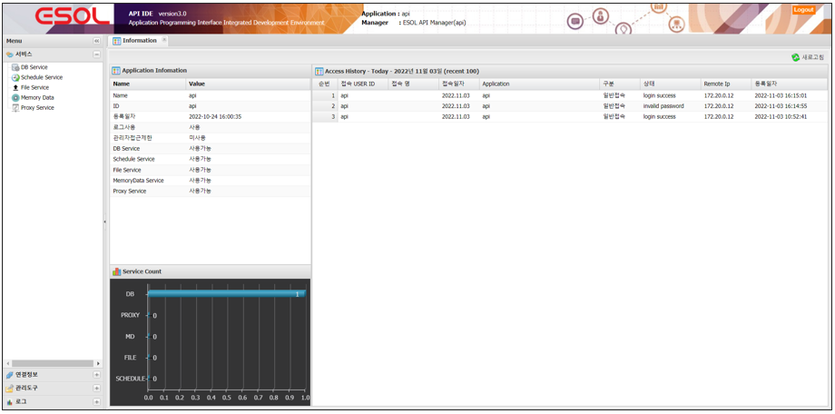

# ESOL MASTER v3.0 usage

---
 

  

  

## 목차

* [서비스](./service) 
    * [DB Service](./service/02-service-database.md) 
    * [SAP Service](./service/02-service-sap.md) 
    * [Custom Service](./service/02-service-custom.md) 
    * [Schedule Service](./service/02-service-schedule.md) 
    * [File Service](./service/02-service-file.md) 
    * [Memory Service](./service/02-service-memory.md) 
    * [Proxy Service](./service/02-service-proxy.md) 
* [연결정보](./connection-information)
	* [DB 연결](./connection-information/01-connection-information-database.md) 
    * [SAP 연결](./connection-information/01-connection-information-sap.md) 
* [관리도구](./management-tools)
    * [서비스 그룹](./management-tools/03-management-tools-service-group.md) 
    * [접속(인증) 관리](./management-tools/03-management-tools-access-manager.md)
    * [java lib(jar) 관리](./management-tools/03.management-javalib.md)
    * 관리자
    * 접속로그
* [로그](./log-tools/04.log-tools.md)
	* 로그 보기
	* 로그 통계 보기
	* 로그 실행수 Top
	* 로그 실행시간 Top
	* 로그 실시간 사용량
	* Proxy 로그 보기