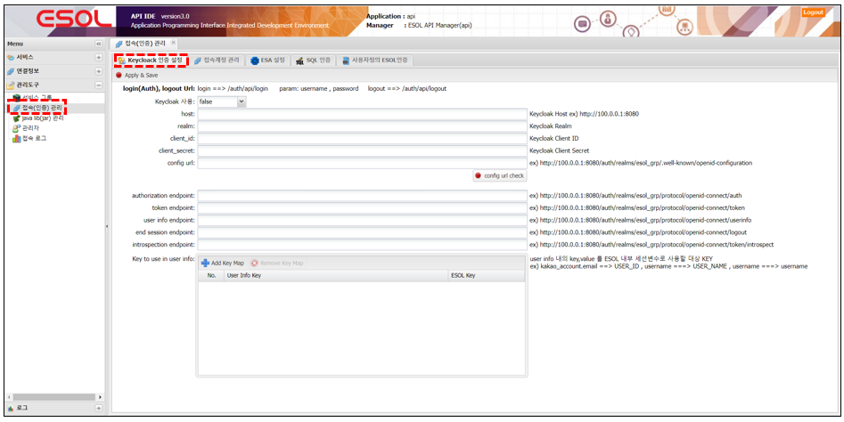
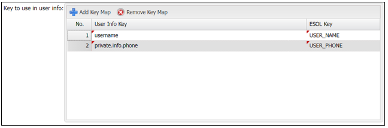
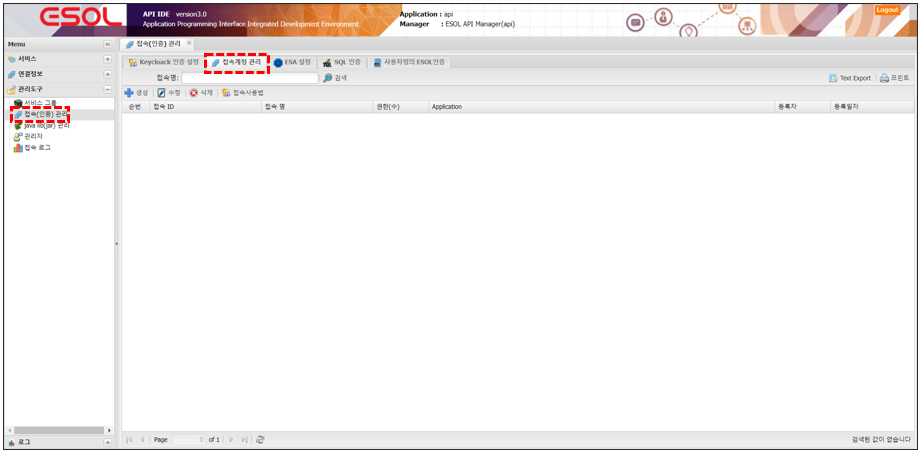

# 접속(인증) 관리
---

## 1. 접속(인증) 관리란
### 1.1. 정의

>서비스 중 인증체크를 사용 하는 서비스에 접근이 가능하게 인증 TOKEN을 발급

### 1.2. 접속 방식

- Keycloak 인증설정 (권장)
- 접속계정관리
- ESA 설정
- SQL 인증
- 사용자정의 ESOL 인증 (설치 버전의 경우에 한함)

## 2. 사용법
### 2.1. Keycloak 인증 설정

 </img>

| 구분 | 설명 |
|:--:|:--|
| Keycloak | 사용유무 설정 |
| host | Keycloak Host `ex)http://100.0.0.1:8080` |
| realm | Keycloak Realm |
| client_id | Keycloak Client ID |
| client_secret | Keycloak Client secret |
| config url | `ex)http://100.0.0.1:8080/auth/realms/esol_grp/.well-known/openid-configuration`|
| 'config url check' | config url을 설정한 경우 해당 버튼을 클릭하면 하위 endpoint 정보를 받아옴 |
| authorization endpoint | `ex)http://100.0.0.1:8080/auth/realms/esol_grp/protocol/openid-connect/auth` |
| token endpoint | `ex)http://100.0.0.1:8080/auth/realms/esol_grp/protocol/openid-connect/token` |
| user info endpoint | `ex)http://100.0.0.1:8080/auth/realms/esol_grp/protocol/openid-connect/userinfo`<br/> ESOL에서 Access Token을 검증하고 사용자 정보를 얻어오는 end point |
| end session endpoint | `ex)http://100.0.0.1:8080/auth/realms/esol_grp/protocol/openid-connect/logout` |
| introspection endpoint | `ex)http://100.0.0.1:8080/auth/realms/esol_grp/protocol/openid-connect/token/introspect` |
| Key to use in user info | user info endpoint에서 받은 사용자 정보 중 ESOL 인증 TOKEN에서 사용할 Key, Value를 맵핑하는 정보 |

#### 2.1.1 Keycloak 인증 속성

>__Service 호출 시__  
>Request Header에 Authorization:Bearer {ACCESS_TOKEN} 입력 하여 호출

> __Keycloak의 user 정보를 ESOL의 TOKEN에 맵핑 예__  
> user info에 username, private.info.phone을 ESOL TOKEN에 USER_NAME, USER_PHONE

 </img>

```
keycloak의 user 정보  예)

{
	“client_id” : “api”
,	.
,	.
,	.
,	“username” : “test@gmail.com”
,	“private” : {
           “info” : {
              “phone” : “01000001111”
           }
     }
};
```

⬇

```
ESOL TOKEN 예)

{
	“USER_NAME” : “test@gmail.com”
,	“USER_PHONE” :  “01000001111”
}
```

- DB Service 에서 세션변수로 사용

```sql         
SELECT   ID
,        {‘$USER_PHONE$’} AS PHONE
FROM    테이블
WHERE   USER_NAME = {‘$USER_NAME$’}
;
```

### 2.2. 접속계정 관리
- 직접 접속계정을 관리하는 기능

 </img>

#### 2.2.1. 접속계정 속성

 </img>

| 구분 | 설명 |
|:--:|:--|
| 접속 ID | TOKEN 발급 시에 필요한 접속 ID |
| 접속 암호 | 암호 |
| 접속 암호 확인 | 암호 확인 |
| 접속 명 | 작업자가 구분하기 위해 사용 |
| 서비스 권한 | __사용안함__ |
| Token 내장 Key-value | ESOL 인증 TOKEN에 사용 할 Key-value 입력 (고정값) |

#### 2.2.2. 접속계정으로 접속 
- 요청
> Access URL : {host}/accessProc.do

```         
Body Data(application/json)
{
   "ACCESS_ID" :"접속ID",
   "PASSWORD"  :"암호“
};
```


```         
Body Data(form-data)
data={
   "ACCESS_ID" :"접속ID",
   "PASSWORD"  :"암호"
};
```

- 응답
> Content-Type : application/json

```         
*성공 
(성공 후  esoljwt , esoljwttime 을 header or cookies 입력하여 서비스 호출 )

{
    success:true,
    message:"",
    esoljwt:"암호화된.문자열.입니다"
    esoljwttime:"_JWT_의 시간"
};

```

```         
*실패
{
    success:false,
    message:"Access Fail(invalid access id or password)"
};

```