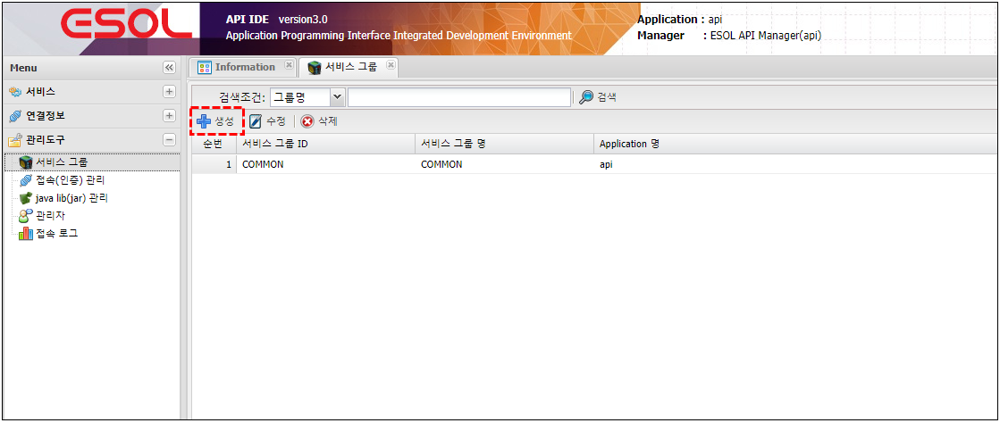
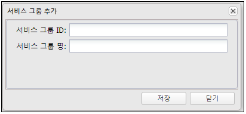

# 서비스 그룹 

---

## 1. 서비스 그룹이란
### 1.1. 정의

>만들어진 서비스를 그룹을 만들어 설정

## 2. 사용법
### 2.1. 생성

🎈 __Menu > 관리도구 > 서비스그룹 > 생성__

 </img>

### 2.2. 속성

 </img>

| 구분 | 설명 |
|:--:|:--|
| 서비스 그룹 ID | 25자 이내 영문,숫자,특수문자('_') |
| 서비스 그룹 명 | 작업자가 구분하기 위해 사용 |