# DB Service

---

## 1. DB Service 란
### 1.1. 정의
>기본적으로 SELECT, INSERT, UPDATE, DELETE 쿼리 수행  
>일반적인 MVC패턴의 controller 와 model 부분 담당

### 1.2. 구조
>DB Service(쿼리)를 작성(등록)하면 WEB상에 호출가능한 서비스(POST)로 생성<br/>
>일반적으로 ajax를 통해 JSON을 주고 받는다.
<<<<<<< HEAD

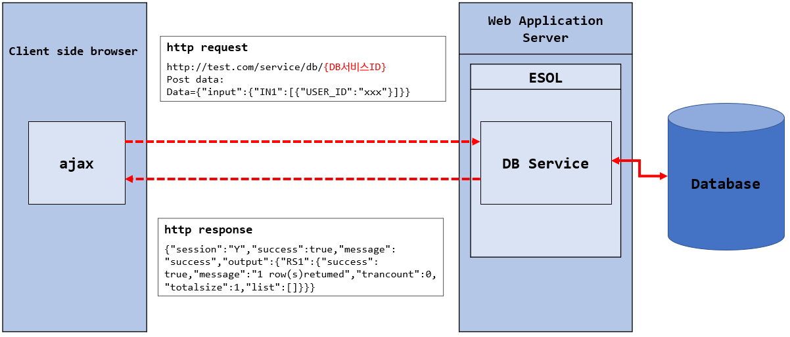 </img>
=======
 </img>
>>>>>>> refs/remotes/origin/master

## 2. 사용법
### 2.1. 생성

🎈 __Menu > 서비스 > DB Service > 생성__

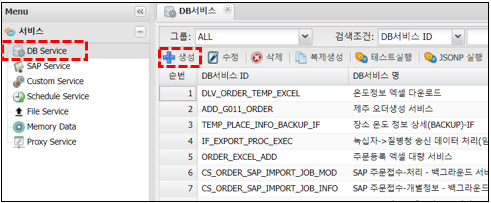 </img>

### 2.2. 속성

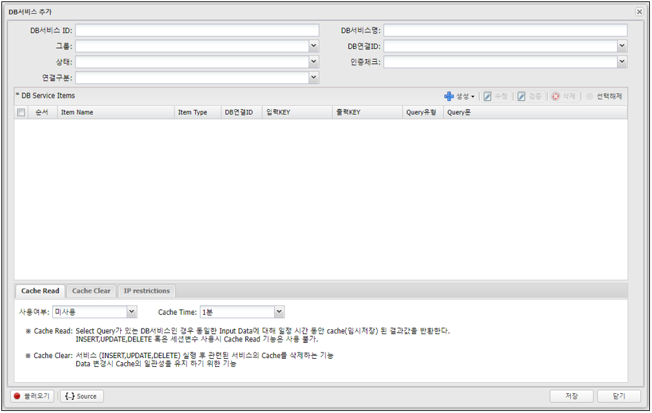 </img>

| 구분 | 설명 |  
|:--:|:--|  
| DB 서비스 ID | 고유한 ID (중복불가, 알파벳, 숫자, 특수문자('_') 30자이내)<br/> {host}/svc/db/{application id}/{DB서비스ID} 로 호출되어지는 서비스로 생성<br/> 단, application 구분이 Main인 경우는<br/> {host}/svc/db/{DB서비스ID} < application id 생략 가능|
| DB 서비스명 | 이름, 혹은 설명을 입력, 작업자가 구분하기 위해 사용 |
| 그룹 | 작업자가 구분하기 위해 사용 |
| DB 연결 ID | DB서비스에서 기본적으로 사용할 DB POOl(connection)<br/> menu > 연결정보 > DB연결 에서 생성된 pool<br/>[DB POOL 생성 방법 참조](/connection-information/01-connection-information-database.md) |
| 상태 | 활성/비활성<br/>비활성일 경우 URL 호출이 제한되나, Schedule Service에서 사용 가능 |
| 인증체크 | 사용/미사용 <br/>미사용이면 누구나 사용 호출 가능 하고, 발급된 Token이 유효한 경우나 로그인 세션이 있는 경우만 사용 여부 정의 |
| POOL 유형 | 전체(선택한 DB연결ID 하나만 사용 TRANSACTION가능):모든 쿼리는 'DB연결 ID'에서 선택한 하나의 DB POOL 사용 <br/>개별(각각의 QUERY의 DB연결ID를 사용 TRANSACTION불가) : 쿼리별로 각각 DB POOL을 지정하여 사용 |
| DB Service Items | Items 생성 참조<br/>[2.3. Items 생성 참조](#23-Items-생성)|

### 2.3. Items 생성

>item은 process 와 query 로 구성,  
>query는 실제 query로 작성,  
>process는 query 그룹이며 여러개의 query를 단위로 실행,  
>query 및 process는 Database 작업이므로 실행 순서가 중요,  
>실행 순서는 마우스를 이용하여 드로그앤드롭으로 순서를 정함  


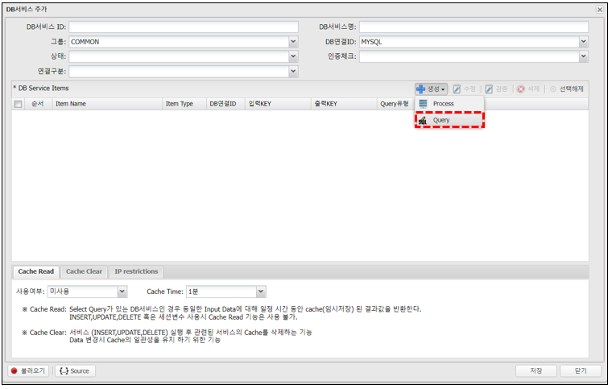 </img>

#### 2.3.1. Item Query 생성

- query는 실제 query(DML)로 작성

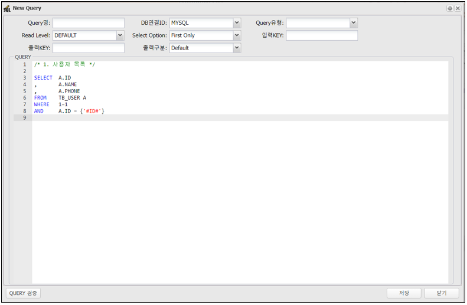 </img>

| 구분 | 설명 |  
|:--:|:--|  
| Query명 | 작업자 쿼리를 구분하기 위해 사용<br/> 예)LIST, ADD, MOD, DEL 등 |
| DB 연결 ID | 해당 쿼리가 사용할 DB Pool 'POOL유형'에서 '개별'로 선택한 경우만 작동<br/>'전체'일 경우는 'DB연결 ID'에서 선택된 pool 사용 |
| Query 유형 | SELECT, INSERT, UPDATE, DELETE, DDL를 확실히 구분 <br/>Query 유형에 따라 결과값을 다르게 받기 때문에 정확히 선택 |
| Read Level | 'Query 유형'이 SELECT 인 경우만 해당함 Transaction Isolation Level을 의미<br/>DBMS별로 확인 필요, 'READ_UNCOMMITED'을 지원 안 하는 DBMS도  있음 (Oracle)<br/>예) INSERT가 계속 발생하는 테이블을 읽을 수 없는 경우 READ_UNCOMMITED로 설정하면 읽을 수 있음 <br/>(권장하지는 않으나 반드시 필요한 경우만 사용)|
| Select Option | Query 유형이 SELECT인 경우만 해당함<br/> First Only : 입력값 Array중 첫번째 record에 대해서만 SELECT <br/>Each : 입력값 Array를 각각 SELECT (마지막 record에 대한 목록만 반환) <br/> Add : 입력값 Array를 각각 SELECT 하고 목록에 추가해서 전체를 반환 |
| 입력 Key | 쿼리가 입력받은 json에서 입력부분 Array의 KEY값을 정의<br/>예) 입력 KEY : IN1<br />json data를  아래와 같은 구조로 입력<br/>```json {"input": {"IN1": [{"USER_LOGIN": ""}]}};``` |
| 출력 Key | 쿼리 수행 후 결과값의 KEY값 정의 |
| 출력 구분 | 결과값에 대한 정의 <br/> (내부적으로 필요하나 사용자에게 보여지면 안되는 정보인 경우에 사용) <br/> dafault : 결과 전체를 반환 <br/> List Clear : SELECT인 경우 목록을 삭제하고 반환 <br/> All Clear : 전체 결과를 삭제  |
| 쿼리 작성 | 실제 수행될 쿼리를 작성<br/>[2.3.2 Query 작성 참조](#232-Query-작성) |

#### 2.3.2. Query 작성 
- 일반변수
	- PreparedStatement의 ? 에 입력, __mybatis의 #{변수명}__ 과 유사 
	- 사용법 : __{'#변수명#'}__
	- WHERE절 부분에는 반드시 일반변수를 권장
- 치환변수
	- 입력값을 해당부분에 치환(replace), __mybatis의 ${변수명}__ 과 유사  
	- ORDER BY의 컬럼명이나 혹은 ASC/DESC 같은 일반변수로 입력이 안되는 경우에만 사용 
	- 보안상 위험하므로 권장하지는 않으나 반드시 필요한 경우
	- 사용하는 경우는 '검증'을 통해 보안상 위험을 제거하기를 권장
	- 사용법 : __{'@변수명@'}__
- Session변수
	- Session변수를 DB Service에서 사용 할 수 있도록 함  
	- Session Attribute의 값을 쿼리 실행시 입력하므로 클라이언트에서 값을 직접 입력 할 필요 없음  
	- 제약사항 : Session Attribute에  key:String , value:String 인 값만 사용  
	- 사용법 : __{'$세션변수명$'}__
	
##### 2.3.2.1. 쿼리 작성 예시 SELECT SAMPLE (입력 KEY : IN)
```sql
SELECT  a.USER_ID
,		a.NAME
,		a.PHONE
,		a.REG_DATE
FROM    TB_USER a
WHERE   a.USER_ID={'$USER_ID$'}  /*세션변수*/
AND     a.NAME LIKE {'#NAME#'}   /*일반변수*/
ORDER BY {'@COL_NAME@'}          /*치환변수*/
;
```

📍 __TIP : Oracle or Tibero 의 경우 query 마지막에 세미콜론(;)을 입력하면 ERROR__

##### 2.3.2.2. 서비스 호출할때 입력 값 작성 예시
- '테스트 실행'시 입력 JSON에 대해 자동 생성

```         
{ "input": {
    "IN": [{
        "NAME": "변수%",            /*일반변수*/
    	"COL_NAME": "a.REG_DATE"   /*치환변수*/
     }]
   }
}
;
```

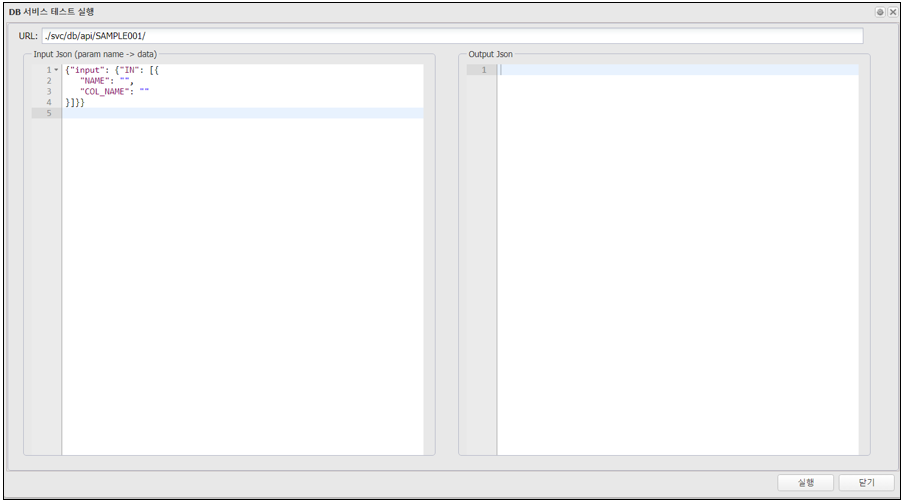 </img>

#### 2.3.3. Items Process 생성

>Process는 Query의 묶음으로서 한 단위로 실행  
>Process내에 Query를 생성하고, Process내에 Process 생성도 가능

- Process Name 과 입력 KEY를 입력 하고 하위에 Query를 작성

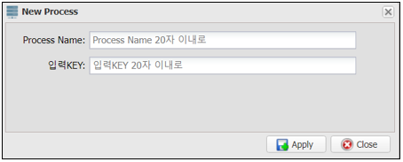 </img>

#### 2.3.4. Items Case

##### 2.3.4.1. Item Case : Query - SELECT

```
IN : [
	{"ID":"ID" , "NAME":"NAME1"} ,
	{"ID":"ID" , "NAME":"NAME2"} ,
	{"ID":"ID" , "NAME":"NAME3"} ,
	{"ID":"ID" , "NAME":"NAME4"} ,
			   .
			   .
			   .
]

총 100 row
```

input Key의 Array만큼 query가 실행 🔻

```sql
Query (select)
input key : IN, output key : RS

SELECT * FROM TABLE WHERE ID={‘#ID#’}


-- select option
 * first only : IN[0] 인 {“ID”:”ID1” , “NAME”:”NAME1”}에 대해서만 1번 SELECT
 * Each : IN Array 100번 SELECT,
          RS에는 각각 SELECT 한 정보 1개만 저장
 * Add  : IN Array 100번 SELECT,
          RS에는 각각 SELECT 한 정보 추가 저장
```

##### 2.3.4.2. Item Case : Query - Insert, Update, Delete, DDL

```
IN : [
	{"ID":"ID" , "NAME":"NAME1"} ,
	{"ID":"ID" , "NAME":"NAME2"} ,
	{"ID":"ID" , "NAME":"NAME3"} ,
	{"ID":"ID" , "NAME":"NAME4"} ,
			   .
			   .
			   .
]

총 100 row
```

input Key의 Array만큼 query가 실행 🔻

```sql
Query (insert , update , delete)
input key : IN, output key : OUT

UPDATE TABLE SET NAME={‘#NAME#’} 
WHERE ID={‘#ID#’}


-- 총 100번 실행
```

##### 2.3.4.3. Item Case : Process

```
IN : [
	{"ID":"ID" , "NAME":"NAME1"} ,
	{"ID":"ID" , "NAME":"NAME2"} ,
	{"ID":"ID" , "NAME":"NAME3"} ,
	{"ID":"ID" , "NAME":"NAME4"} ,
			   .
			   .
			   .
]

총 100 row
```

 input Key의 Array만큼 query가 실행 🔻

```sql
Process
input key : IN   
  - Query (select)  OUTPUT: RS_USER , select option : each
    SELECT NAME,PHONE FROM USER WHERE ID={‘#ID#’}

  - Query (insert)  OUTPUT: OUT_ADD
    INSERT INTO USER_EXT(ID,PHONE) 
    VALUES({‘#ID#’}, {‘#RS_USER[0].PHONE#’})

  - Query (update)
    UPDATE USER_EXT
    SET UPDATED_DT = CURRENT_TIMESTAMP
    WHERE ID = {‘#ID#’}

  - Query (delete)
    DELETE FROM USER WHERE ID={‘#ID#’}


  * 위의 Process 4개의 Query가 한 단위로 100번 실행
```

### 2.4. 검증

>입력값에 대한 server side 검증  
>DB Service 입력 값에 대한 검증(validation)  
	
- 쿼리를 선택하고 '검증' 버튼 클릭  

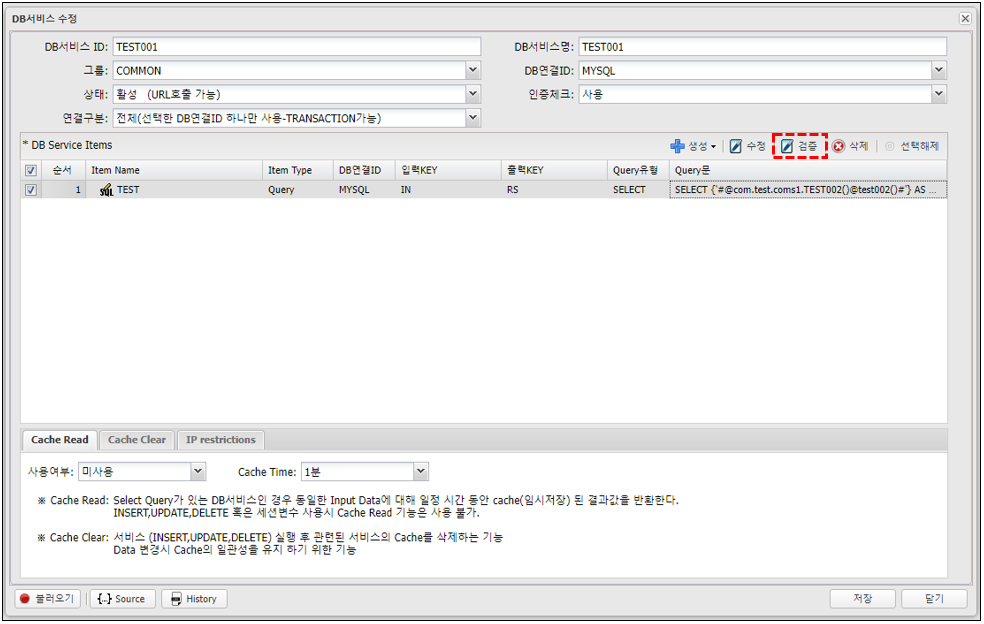 </img>

#### 2.4.1. 검증 생성/수정
- 입력 항목 명
	- 입력 항목을 선택
	- 일반변수, 치환변수의 목록이 나타난다. 세션변수는 제외  
      'query-sample001' 기준으로 NAME, COL_NAME
- 에러메세지 검증실패 시 Client에 보내줄 에러메세지

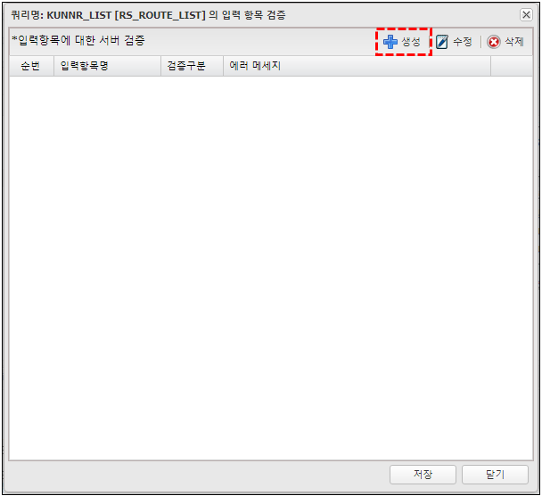 </img>


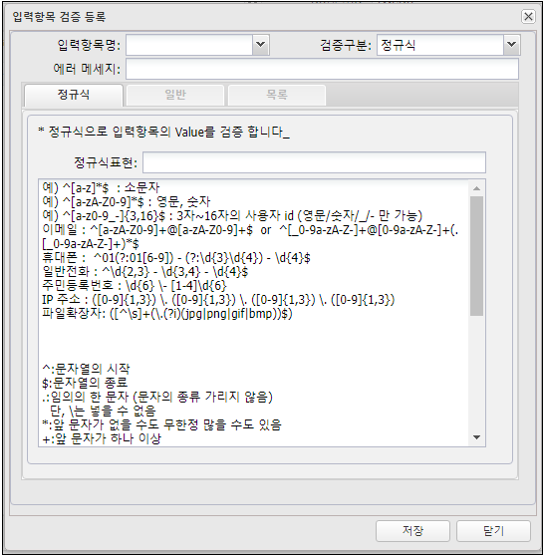 </img>

⚙ __검증구분__  

| 구분 | 내용 |
|:--:|:--|
| 정규식 | 입력값을 정규식으로 검증 |
| 일반 | 항목유형(변수타입,숫자,문자 제한등), 최소길이(크기), 최대길이(크기) 검증 |
| 목록 | 목록에 있는 값인지만 판단,<br/>ORDER BY의 정렬부분의 치환변수 값을 검증 할때는 ‘ASC’와’DESC’를 목록에 입력 |

### 2.5. 테스트
>DB Service를 직접 실행 해보는 기능  
>쿼리의 입력변수에 맞게 'Input JSON' Textarea에 json문법이 자동으로 작성(값만 직접 입력해서 테스트 실행)  
>클라이언트 사이드에서는 테스트의 json sample를 확인하고 입력 테스트 하고 결과값을 확인하여 개발 진행  
>POST만 지원

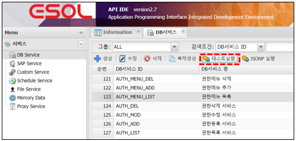 </img>

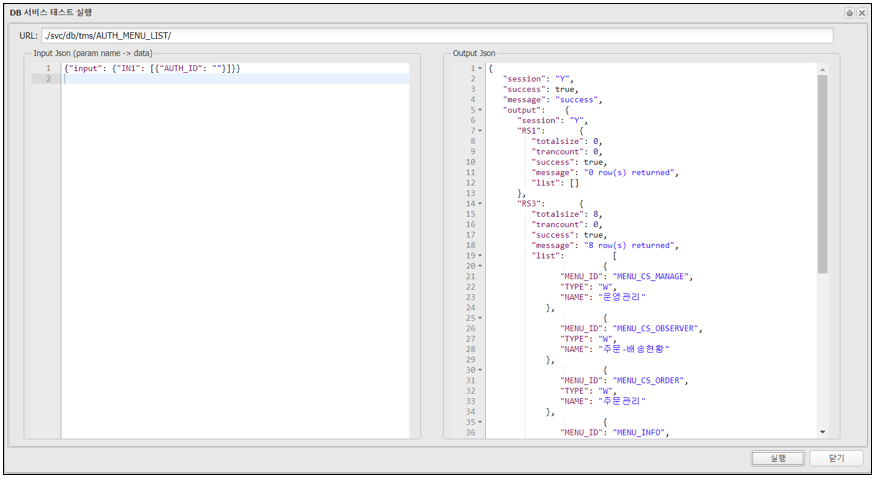 </img>

### 2.6. Cache
#### 2.6.1. Cache Read

>DB Service 결과를 Cache에 일정 시간 동안 저장하고 결과를 반환하는 기능  
>CUD가 거의 없고 조회가 빈번한 경우만 사용 권장

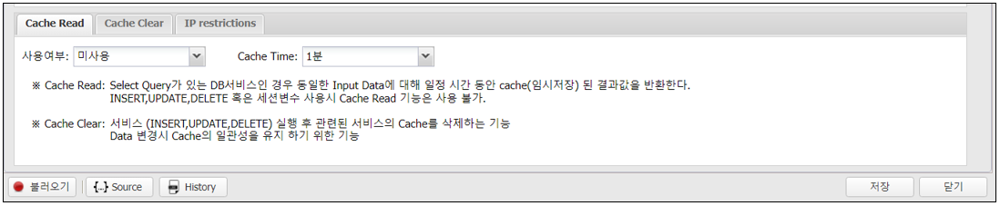 </img>

#### 2.6.2. Cache Clear
>DB Service 실행 후 Cache를 삭제하는 기능
- 예) 공통코드 조회 DB Service가 Cache Read를 사용하는데<br/> 공통코드 추가, 삭제, 수정 DB Service가 실행된 경우 cache를 삭제

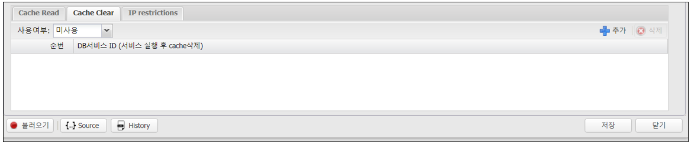 </img>

#### 2.6.3. IP Restrictions
>해당 DB Service에 IP 별 접근 제한 기능

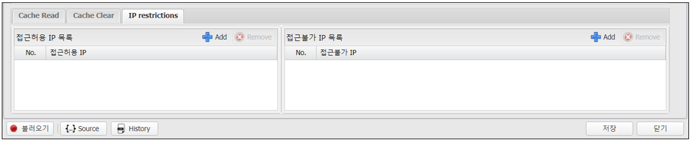 </img>

#### 2.6.4. 불러오기
>다른 DB Service의 Query를 참조 해야 하는 경우

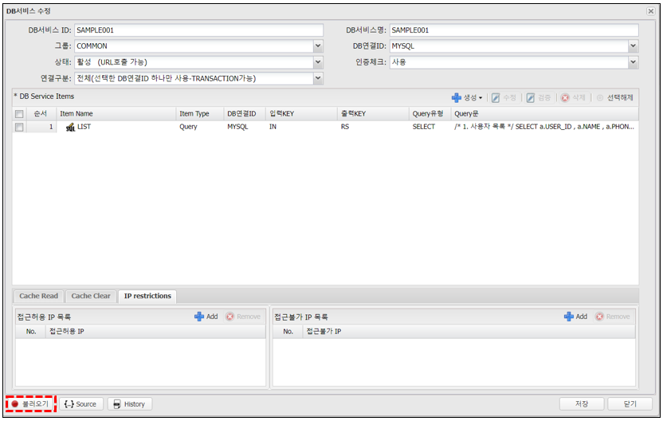 </img>

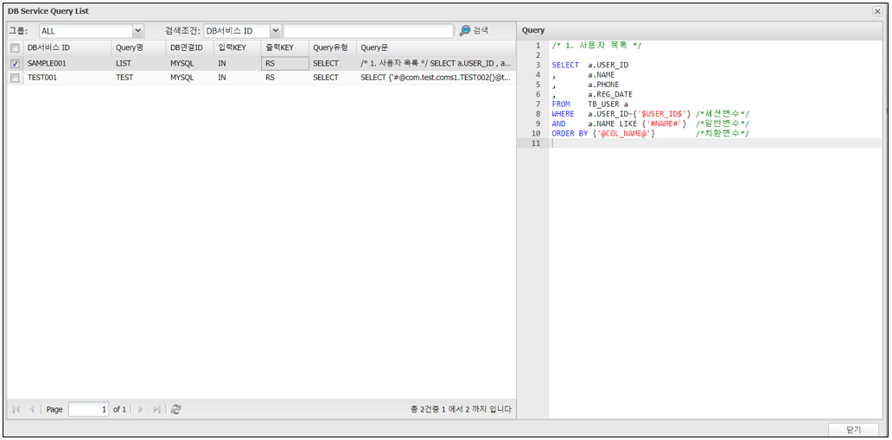 </img>

#### 2.6.5. Source
>다른 DB Service의 전체 내용을 복사해서 사용 할 경우  
>Source를 직접 수정하여 DB Service 내용 수정 가능  
>Source 내용을 복사 하여 다른 DB Service에 적용하여 사용

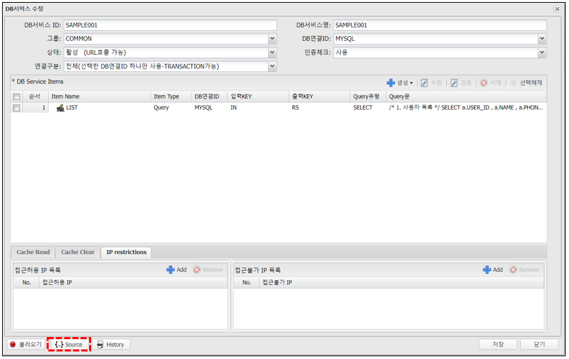 </img>

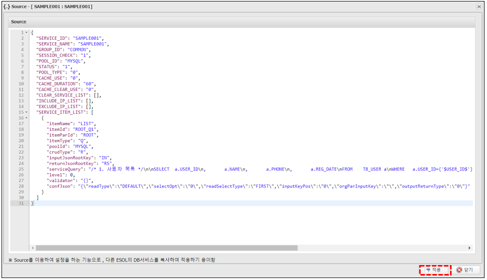 </img>


#### 2.6.6. History
>DB Service 수정 시 이전 DB Service의 정보를 저장  
>이전 DB Service의 History를 다시 불러 올 수 있는 기능

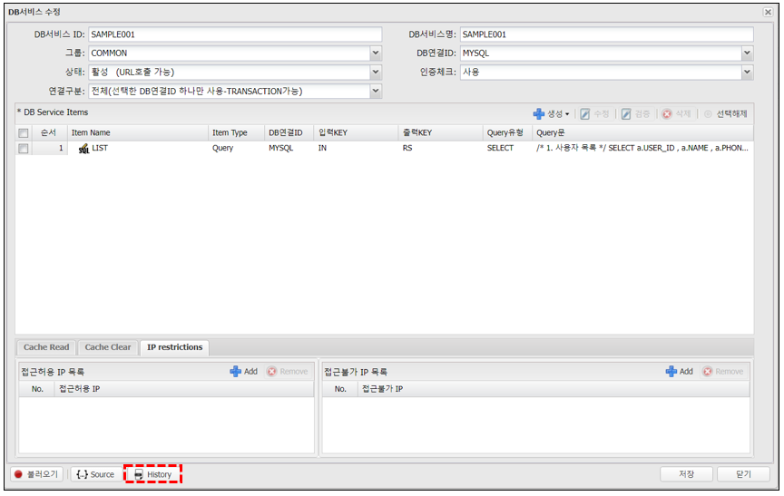 </img>

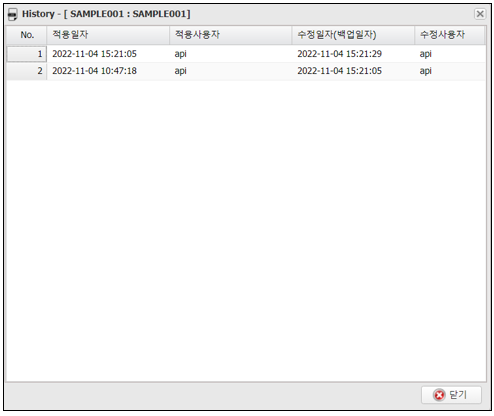 </img>

## 3. Dynamic Query
### 3.1. javascript
>javascript 문법으로 Dynamic Query를 지원  
>구조는 JSP와 유사  
>JSP 의 __<% %>__ 와 유사하게 __<! !>__ 안에 javascript 문법 사용  
  
>Query가 실행 되기 직전에 query를 input data(Input Json 등)로  
>Dynamic하게 생성하고 약간의 프로그래밍을 구현

⚙ __예약된 객체__

| 객체명 | 타입 | 설명 |
|:--:|:--:|:--|
| Data | JSON Object | input > Array의 record를 담은 JSON객체 <br/> 예) input: "IN":[<span style="color:red">{"ID":"ID" , "NAME":"NAME"}</span>] <br/> data.ID , data.NAME 으로 사용 |
| Session | JSON Object | Session 변수를 담은 JSON 객체 |
| Out | Object | (append(obj), toString()만 있음) Output 객체 |
| Skip | function | 특정 조건에서 Query를 실행하지 않고 Exception도 발생되지 않는 기능<br/> for문의 continue 같은 기능 |
| DBexception | function | 특정 조건에서 Query를 실행하지 않고 Exception을 발생 시켜서<br/> rollback 되고 DB Service를 빠져 나가는 기능 <br/> 예)dbexception("유효하지 않은 값입니다."); |
| update<br/>JsonObject | function | 위의 data 객체는 readonly이나 data의 값을 변경을 하고 싶은 경우 사용<br/> 예) data.NAME='다른이름'; <br/> data.ADD_VAL='추가 변수'; <br/> updateJsonObject(data); |
| _inputJson | java object<br/>(net.sf.json.JSONObject) | input data 전체가 들어있는 JSONObject 객체 |
| _outputJson | java object<br/>(net.sf.json.JSONObject) | output data 전체가 들어있는 JSONObject 객체 |
| _request | java object<br/>HttpServletRequest | HttpServletRequest 객체 |
| _response | java object<br/>HttpServletResponse | HttpServletResponse 객체 |

### 3.2. 예제
#### 3.2.1. 입력 변수의 유무조건
- Query  
```sql         
SELECT  	A.USER_ID
,  			A.USER_NAME
FROM  		TB_USER A
WHERE   	1=1
<!
     if(data.USER_ID !== undefined){
!>
     AND A.USER_ID = {'#USER_ID#’}
<!
     }
!>      

```

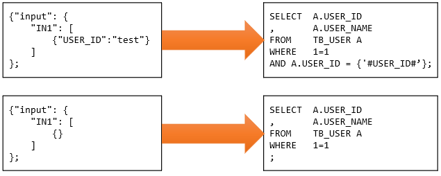 </img>

#### 3.2.2. WHERE 절 IN 생성 query

- Query  
```sql         
SELECT  A.USER_ID
,       A.USER_NAME
FROM  	TB_USER A
WHERE   1=1
<!
   if(data.USER_IDS !== undefined){
      if(data.USER_IDS.length>0){
		 var strIns="";
		 for(var i=0;i<data.USER_IDS.length;i++){
	   		var json = data.USER_IDS[i];
	    	if(i==0){
	       		strIns+="'"+json.USER_ID+"'";
	    	}else{
	       		strIns+=",'"+json.USER_ID+"'";
	    	}
	 	 }
	 	strIns = "("+strIns+")";
	 	out.append("AND A.USER_ID IN " + strIns + " ");
      }
   }
!> 

```

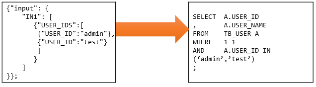 </img>

#### 3.2.3. Skip 및 Exception
- Query
```sql         
<!
    if(data.USER_ID == ‘admin’ ){
   		dbexception(“ admin 은 사용 불가 ”);
    }
    if(data.USER_ID == ‘manager’ ){
       skip();
    }
!>
SELECT  A.USER_ID
,       A.USER_NAME
FROM    TB_USER A
WHERE   1=1
AND     A.USER_ID = {‘#USER_ID#’}
;
```

### 3.3 Java method 실행

>DB Service 에서 java method를 실행  
>method return은 반드시 String 만.

- 일반 method
	> {'#@클래스명()@메소드()#'}  
	>예) SELECT {'#@com.test.coms1.TEST002()@TEST002()#'} AS CLASS_NAME

- daclared method (static method)
	> {'#@클래스명@메소드()#'}  
	> 예){'#@com.evan.platform.util.EvanEnc@encryptSHA256("1234")#'} AS ENC_TXT

- 클래스 생성자 및 메소드 Argumetns 규칙<br/>
String, int, long, float, double, JSONObject, JSONArray

```
* 인수처리 입력 방법
1. data 내의 변수 입력 (String만) *권장
	method(NAME)  
2. ""은 String으로 인식
	method("직접입력")  
3. 인수형식 입력 # 으로 구분
	method(int#1, long#100, float#1.1, double#1.11, JSONObject:IN[0], JSONArray#RS)
```

__예) --java method__
```         
package com.test;
public class TEST {
   		public TEST(){
        }
  		public String testMehod(String strName){
          	return strName + “ method call ”;
   		}    
};
```

__-- DB Service Query (input key : "IN" , output key : "RS")  
```{"input":{"IN":[{"NAME1":"NAME1","NAME2":"NAME2"}]}};```__

```sql         
1. 현재 Record의 값을 사용

SELECT  {'#@com.test. TEST()@ testMehod(NAME1)#'} AS NAME
결과 : 
{
  	"session": "Y",
	"success": true,
	"message": "success",
	"output": {
		"session": "Y",
		"RS": {
   			"totalsize": 1,
   			"trancount": 0,
   			"success": true,
   			"message": "1 row(s) returned",
   			"list": [{
       			"NAME" : "NAME1 method call "
       		}]
		}
	}
};
```

- 대량의 자료 SELECT해서 java Method에서 처리하고 결과 값을 DB에 저장하고 싶은 경우에는 JSONArray로 처리 

__예) --java method__

```         
package com.test;
import net.sf.json.JSONArray;
import net.sf.json.JSONObject;
public class TEST {
   	public TEST(){
    }
   		public String testMehod(JSONArray list){
           	String rtn = “”;
           	for( int i=0;i<list.size();i++ ){
               String result = this. execute(list.getJSONObject(i));
               list.getJSONObject(i).put(“RESULT” , result ); // 처리결과를 json에 입력
           	}
           	return rtn; 
   		}
   		private String execute(JSONObject json){
           	String rtn = “”;
            	// json으로 값을 처리 , 성공은 “1” , 실패는 : “0”
           	return rtn;
   		}   
};
```

__-- DB Service Query  
```{"input":{"IN":[{}]}};```__

```sql        
1.대상 SELECT query (input key : "IN", output key : "RS")
 
SELECT	ID
,       NAME
FROM    TARGET_TABLE;  
// query 실행 직후 RS에  {“ID”:”ID”, “NAME”:”NAME”}  의 json
```


```sql         
2.java method 실행 query (input key : "IN", output key : "OUT")

SELECT  {'#@com.test. TEST()@ testMehod(JSONArray#RS)#'} AS RESULT ;  
// java method 실행 직후  RS에  {“ID”:”ID”, “NAME”:”NAME”,”RESULT”:”1”} 의 json
```

```sql         
3.결과값 저장 query (input key : "RS", output key : "OUT_RESULT")

// 실행 직전에  RS에는  “RESULT” KEY 가 존재 한다.
UPDATE 	TARGET _TABLE
SET     RESULT = {‘#RESULT#’}
WHERE   ID = {‘#ID#’};

```

## 4. Tip

### 4.1. input Key 중복사용
> DB Service는 여러개의 쿼리를 한번에 실행


1번 쿼리: SELECT * FROM TB_USER WHERE USER_ID={'#USER_ID#'};  
2번 쿼리: SELECT * FROM TB_USER_HISTORY WHERE USER_ID={'#USER_ID#'};

>여기서 입력변수 USER_ID가 같은 값이라면 각각 쿼리의 Input Key를 다르게 하지 않고 1개로 같이 사용


1번 쿼리 input key: IN1 , output key: RS1  
2번 쿼리 input key: IN2 , output key: RS2

 

```
*input json 구조

{"input": {
    "IN1": [{"USER_ID": ""}]
    ,"IN2": [{"USER_ID": ""}]
}};
```


1번 쿼리 input key: IN1 , output key: RS1  
2번 쿼리 input key: IN1 , output key: RS2


```
*input json 구조

{"input": {
    "IN1": [{"USER_ID": ""}]
}};
```


### 4.2. output key 를 input key로 사용
>SELECT 한 값을 INSERT, UPDATE, DELETE 하고 싶은 경우  
>혹은 SELECT 한 값으로 다른 SELECT를 하고 싶은 경우  
>물론 같은 DB pool이면 이러한 일을 한다는 건 무의미  
  
>각각 쿼리의 DB pool이 다른 경우에 사용  
>예를 들어 oracle에서 select해서 mssql에 insert 하고 싶은 경우에 해당


1번 쿼리: SELECT A.USER_ID as UID FROM oracle.TB_USER A WHERE A.USER_ID={'#USER_ID#’};  
2번 쿼리: INSERT INTO mssql.TB_USER_HISTORY(UID) VALUES ({'#UID#'});  

1번 쿼리 input key: IN1 , output key: RS1  
2번 쿼리 input key: RS1 , output key: RS2

```
*input json 구조

{"input": {
    "IN1": [{"USER_ID": ""}]
}};
```

>이렇게 하면 1번 쿼리의 output key RS1에 있는 list array의 값을 2번 쿼리에 input key로 사용  

>물론 이런 경우 원하는 것은 결국 mssql의 INSERT 이지만 결과값 RS1의 list가 return,  
>만약 1번 쿼리의 값을 받기 싫다면 'TMP_' 를 key앞에 넣으면 list array를 비워서 보냄  


1번 쿼리 input key: IN1 , output key: TMP_RS1  
2번 쿼리 input key: TMP_RS1 , output key: RS2


